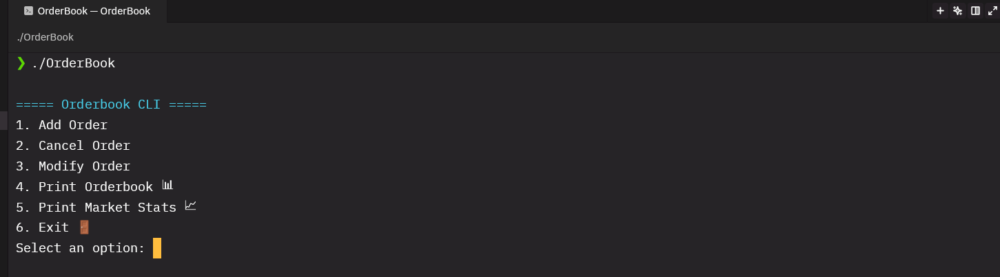
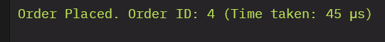
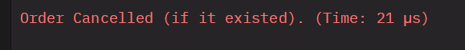
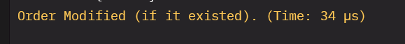
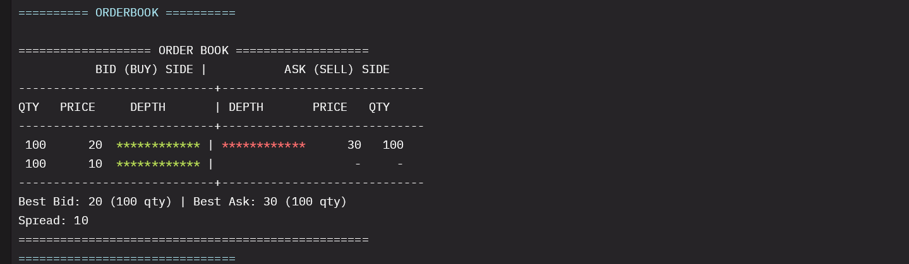
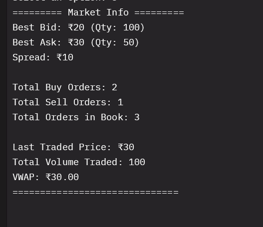
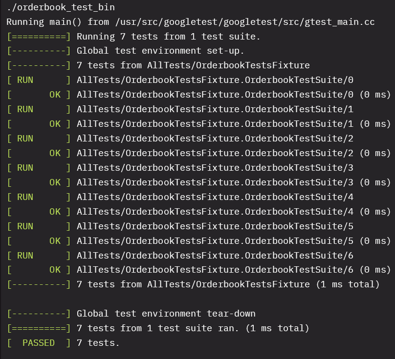

# 🧮 OrderBook CLI – Modern C++ Trading Simulator

Welcome to **OrderBook CLI**, a high-performance trading engine simulator built using **modern C++20**, designed with **OOP**, **STL containers**, **RAII**, and **multithreading** principles. This project simulates a basic stock exchange order book and allows you to:

- Add/Cancel/Modify orders
- Match trades automatically
- View market stats (VWAP, Last traded price, Best bid/ask)
- Run unit tests using GoogleTest

---

## 📸 Interface Preview

### 📋 Menu



---

### 🟢 Placing an Order



---

### 🛑 Cancelling an Order



---

### ✏️ Modifying an Order



---

### 📈 Viewing Orderbook



---

### 📊 Viewing Market Stats



---

### 🧪 Running Unit Tests



---

## 🧠 Features & Concepts

### 🏗️ Object-Oriented Design

- **Orderbook**: Core engine that handles all operations.
- **Order**: Encapsulates trading intent.
- **OrderModify**: Lightweight utility to modify existing orders.
- **Trade / TradeInfo**: Encapsulates matched trades (Buy/Sell pairs).
- **OrderbookLevelInfos**: Returns L1 data (Best bid/ask and levels).

---

### 🚀 Modern C++ Practices

| Feature | Description |
|--------|-------------|
| `std::shared_ptr` | Manage order lifetimes automatically (RAII) |
| `std::map`, `std::unordered_map` | High-performance containers for O(1)/logN ops |
| `std::mutex`, `std::thread` | Thread-safe design with cleanup support |
| `enum class`, `constexpr`, `auto` | Safe and expressive coding |
| `chrono` | High-resolution order timing and benchmarking |
| `Makefile` | Portable build system with support for testing and cleanup |

---

## 📈 Market Metrics

The system auto-calculates and displays:

- ✅ **Last Traded Price**
- 📊 **Total Volume Traded**
- 📉 **VWAP (Volume-Weighted Average Price)**
- 🏷️ **Best Bid / Best Ask**

---

## ⚙️ Building & Running

### 🔨 Compile the Project

```bash
make
````

### ▶️ Run the CLI App

```bash
make run
```

### ✅ Run Unit Tests (GoogleTest)

```bash
make test
```

### 🧹 Clean Build Files

```bash
make clean
```

> ✨ **Tip**: All test files are in `OrderbookTest/` and follow the GoogleTest pattern.

---

## 📦 File Structure

```
├── Orderbook.cpp / .h          # Core orderbook logic
├── Order.h / OrderModify.h     # Order definitions and mods
├── Trade.h / TradeInfo.h       # Matched trade details
├── LevelInfo.h                 # Price levels (bids/asks)
├── OrderbookLevelInfos.h       # Bid-Ask L1 data summary
├── Usings.h                    # Common typedefs
├── main.cpp                    # CLI interface
├── Makefile                    # Build system
├── OrderbookTest/test.cpp      # GoogleTest unit tests
├── Images/                     # Screenshots for demo
└── README.md                   # You're reading it!
```


---

## 🙌 Credits

Made with ❤️ by [Muqeeth](https://github.com/muqeeth26832) – a Computer Science undergrad, passionate about systems, performance engineering, and solving real-world problems through clean design.

---

## 📜 License

This project is open-source.
